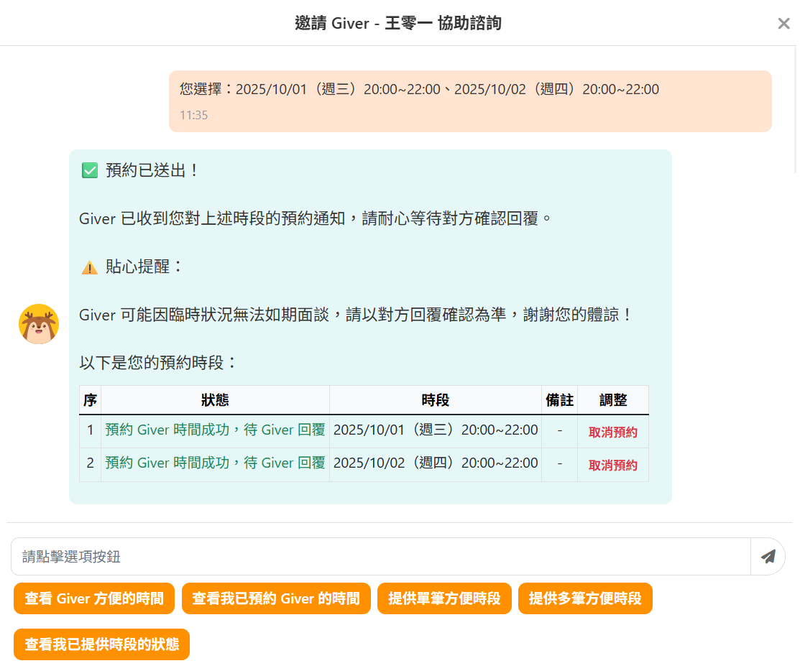
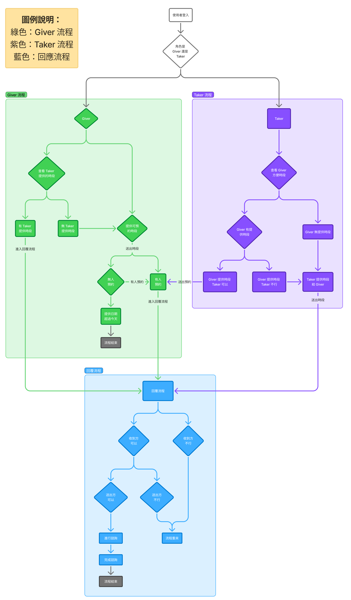
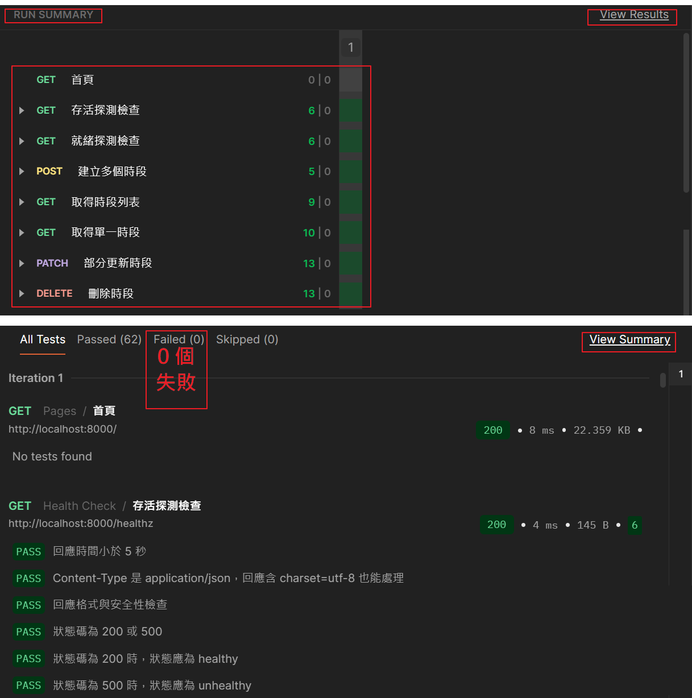
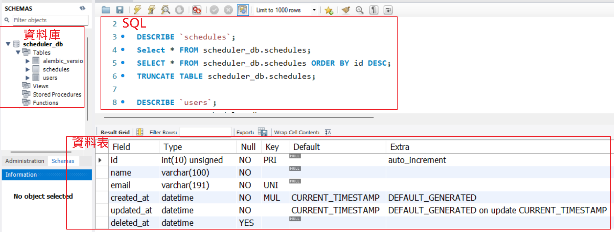
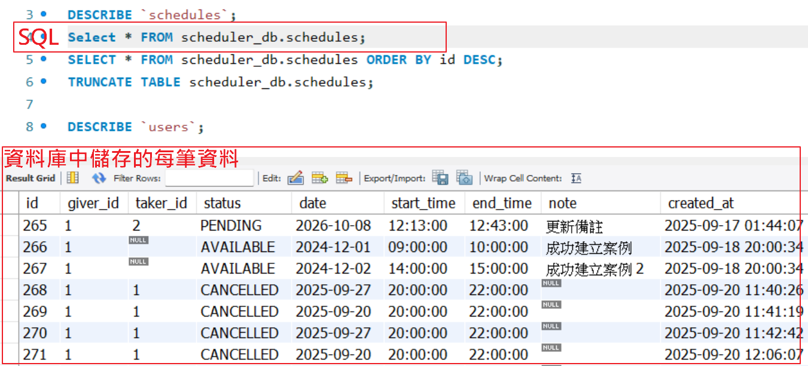
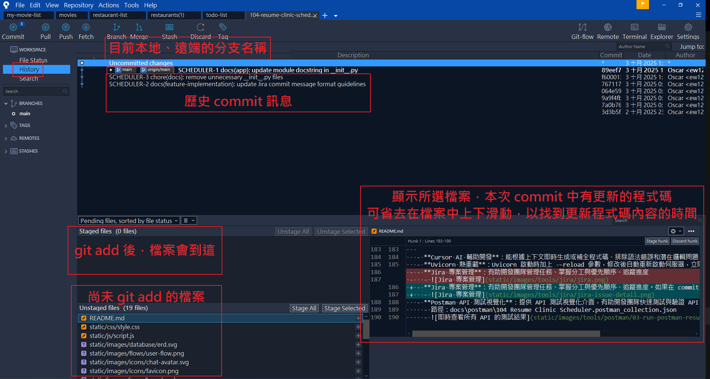
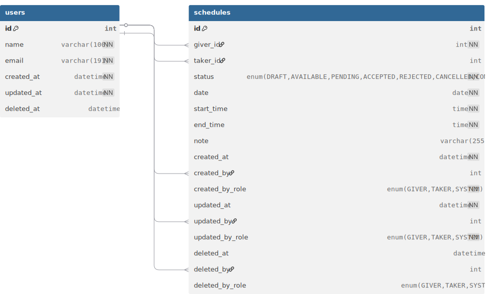
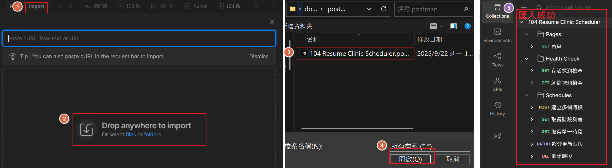
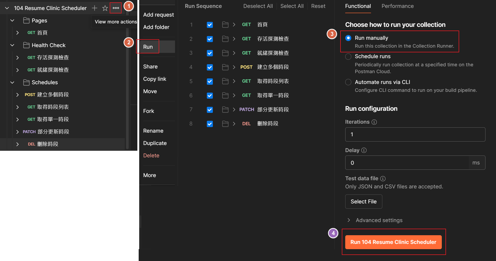

# 104 履歷診療室 - 平台內諮詢時間媒合系統

[](https://github.com/ewsailor/104-resume-clinic-scheduler)
[](https://www.python.org/downloads/)
[](https://fastapi.tiangolo.com/)
[](https://www.mysql.com/)
[](https://python-poetry.org/)
[](https://github.com/ewsailor/104-resume-clinic-scheduler/actions/workflows/ci.yml)
[](https://github.com/ewsailor/104-resume-clinic-scheduler)

## <a name="目錄"></a>目錄

- [專案概述](#專案概述)
  - [使用者故事與核心功能](#使用者故事與核心功能)
  - [使用者介面截圖](#使用者介面截圖)
  - [使用者流程圖](#使用者流程圖)
- [架構設計](#架構設計)
  - [技術棧與選型理由](#技術棧與選型理由)
  - [安全性](#安全性)
  - [可維護性與可擴充性](#可維護性與可擴充性)
  - [可靠性](#可靠性)
  - [效能](#效能)
  - [開發效率](#開發效率)
    - [速懂新技術與選型理由 AI Prompt 模板](#tech-quickstart-insight)
    - [實作功能 AI Prompt 模板](#feature-implementation)
- [快速開始](#快速開始)
  - [環境需求](#環境需求)
  - [安裝步驟](#安裝步驟)
  - [啟動方式](#啟動方式)
- [技術架構](#技術架構)
  - [專案結構](#專案結構)
  - [ERD 實體關聯圖](#erd-實體關聯圖)
  - [API](#api)
    - [API 分層架構設計](#api-分層架構設計)
    - [RESTful API](#restful-api)
    - [Swagger/ReDoc：查看 API 請求與回應範例](#swagger-redoc-請求與回應範例)
    - [Postman：Collection Runner 一鍵測試所有 API](#postman-一鍵測試所有-api)
  - [Pytest 測試](#pytest-測試)
    - [測試資料管理：夾具 Fixtures](#夾具-fixtures)
    - [行為驅動開發 BDD：Given-When-Then](#GIVEN-WHEN-THEN)
    - [參數化測試裝飾器](#參數化測試裝飾器)
    - [單元測試](#單元測試)
    - [整合測試](#整合測試)
    - [測試覆蓋率](#測試覆蓋率)
  - [自動化測試](#自動化測試)
    - [pre-commit](#pre-commit)
    - [CI/CD](#cicd)
- [未來規劃](#未來規劃)
  - JWT 登入功能、Redis、WebSocket 通知功能、MongoDB、Docker、端對端測試、AWS 部署
- [開發者](#開發者)

## <a name="專案概述"></a>專案概述 [返回目錄 ↑](#目錄)

### <a name="使用者故事與核心功能"></a>使用者故事與核心功能 [返回目錄 ↑](#目錄)

讓 Giver（診療服務提供者）與 Taker（診療服務接受者）能在平台內，方便地設定可面談時段並完成配對媒合，同時提供即時通知，以減少等待回應時的不確定與焦慮感。

完整使用者故事請[點此](./docs/user-stories.md)查看，以下簡述本專案的主要使用者故事：

- Giver 提供可預約的時段，讓 Taker 預約面談
- Taker 提供方便的時段，待 Giver 回覆是否方便面談
  - 因 Giver 尚未提供可預約的時段，Taker 無法預約面談
  - 因 Giver 已提供的方便時段，Taker 均不方便面談

#### **已完成功能**

- ✅ 時段的 CRUD 操作：使用者新增、查詢、編輯、刪除時段
- ✅ 時段重疊檢查，避免新增或更新時段時造成衝突
- ✅ 查詢支援多種篩選條件
- ✅ 軟刪除機制和審計追蹤
- ✅ 時段狀態 ENUM 管理：DRAFT、AVAILABLE、PENDING、ACCEPTED、REJECTED、CANCELLED、COMPLETED

#### **待開發功能**

- 登入功能：能快速註冊並登入系統，以開始進行預約
- 通知系統：即時訊息通知、預計回覆時間通知、自動提醒功能（逾期回覆提醒）
- 鎖定已被預約的時段，避免時段被重複預約
- 媒合與使用數據報表

### <a name="使用者介面截圖"></a>使用者介面截圖 [返回目錄 ↑](#目錄)

- Giver 列表
  - 
- Taker 預約 Giver 時段
  - 
  - 
- Taker 提供方便時段給 Giver
  - 
  - 

### <a name="使用者流程圖"></a>使用者流程圖 [返回目錄 ↑](#目錄)

完整流程請詳下圖，以下簡述本專案的主要使用者流程：

- **Giver 流程**
  - Giver 提供可預約的時段，讓 Taker 預約面談
  - Giver 查看 Taker 提供的時段，並回覆自己是否方便
- **Taker 流程**
  - Taker 查看 Giver 提供的時段，並進行預約
  - Taker 提供方便的時段，待 Giver 回覆是否方便面談
- **回覆流程**
  - 收到方不行：流程重來
  - 收到方可以
    - 送出方不行：流程重來
    - 送出方可以：進行諮詢



## <a name="架構設計"></a>架構設計 [返回目錄 ↑](#目錄)

### <a name="技術棧與選型理由"></a>技術棧與選型理由 [返回目錄 ↑](#目錄)

本專案主要使用技術為 `Python`、`FastAPI` 框架 + `SQLAlchemy`、`MySQL`/`MariaDB`資料庫，採分層架構設計避免高耦合，依 `RESTful` 原則設計時段（Schedule）的 `CRUD API`，可於 `Swagger`/`ReDoc`查看 API 請求與回應範例，用 `Postman`、`pytest`、`pre-commit`、`CI/CD` 確保程式碼品質，並有考量安全性、可維護性與可擴充性、可靠性、效能、開發效率。

#### **後端框架**

- **`Python` 3.12.8**：現代 `Python` 版本，支援最新語法特性，效能優化
  - `Python` 3.9+ 支援語法：
    - 可用 `dict`、`list`、`set`、`tuple` 替代 `Dict`、`List`、`Set`、`Tuple`，不需額外匯入 `typing` 模組
  - `Python` 3.10+ 支援語法：
    - 可用 `match`/`case` 替代大量 `if-elif-else`
    - 可用 `X | Y` 替代 `Union[X, Y]` 聯合類型
    - 可用 `X | None` 替代 `Optional[X]` 可選類型
- **`FastAPI` 框架**：高效能非同步框架、自動生成 `Swagger`/`ReDoc API` 文件、型別檢查支援、依賴注入
- **`Uvicorn` 非同步/熱重載**：`ASGI` 非同步伺服器支援高併發 `API` 請求、支援修改後自動重新啟動伺服器，立即看到修改效果
- **`Pydantic` 輸入驗證**：輸入資料不符合 `schema` 設定的型別和格式會報錯，確保資料正確性，避免系統崩潰

#### **架構設計**

- **`API` 分層架構**：從用戶請求到回應，依職責拆分成 `CORS` → `Routers` → `Schemas` → `Service` → `CRUD` → `Models` → `DB`，降低耦合度
- **自訂錯誤處理、`Log Decorator`**：統一錯誤回傳與日誌格式，避免重覆寫 `try...except`、快速定位問題
- **`Poetry`**：用 `pyproject.toml` 定義依賴的版本範圍，用 `poetry.lock` 鎖定確切依賴版本，確保環境一致性
- **`Pydantic Settings` 配置管理**：配置參數從 `.env` 讀取避免敏感資訊洩露，且讀取時會驗證每個值的型別，降低錯誤配置風險
- **健康檢查**：監控應用程式是否存活、就緒，異常發生時自動重啟或流量導向健康的實例，確保服務穩定
- **`CORS` 跨域請求控管**：只允許經授權的網域訪問後端 `API`，避免惡意網站存取後端 `API`
- **`Jinja2` 模板引擎**：在伺服器端，將資料動態渲染到 `HTML` 模板並回傳給用戶，使用模板繼承保持 `HTML` 結構一致、對變數自動轉義防止 `XSS 攻擊`、支援快取已編譯的模板提高效能


#### **品質確保：`API` 與測試**

- **`Swagger`/`OpenAPI`**：`FastAPI` 自動生成的互動式 `API` 文件，可點擊 `Try it out` 測試 `API`
- **`ReDoc`**：`FastAPI` 自動生成的單頁式閱讀 `API`，可快速閱覽 `API` 請求與回應範例
- **`Postman` `API` 測試**：提供 `API` 測試視覺化介面，有助開發團隊快速測試與驗證 `API`，且可用 `Collection Runner` 一鍵運行集合中所有自動測試腳本，即時查看所有 `API` 的測試結果
- **`pre-commit`**：每次提交 `commit` 前自動檢查 `fix_imports.py`、`autoflake`、`isort`、`black`、`flake8`、`mypy`，確保程式碼品質
- **`Pytest`**：測試框架，支援單元測試、整合測試
- **`Pytest-cov`**：測試覆蓋率分析
- **`CI/CD`**：已落實 `CI`，每次提交程式碼後 `GitHub Actions` 會自動執行 `pre-commit`、`pytest` 測試，確保程式碼變更後沒有破壞現有功能，`CD`（持續交付、持續部署）將於未來擴充

#### **資料庫與 `ORM`**

- **`MySQL`/`MariaDB` 關聯式資料庫**：適合處理結構化資料如時段預約、支援 `ACID` 事務確保資料一致性
- **`SQLAlchemy` `ORM`**：以 `Python` 物件而非 `SQL` 操作資料庫、使用參數化查詢避免 `SQL 注入`，切換資料庫方便因只需改連線設定資料庫，降低 `SQL` 拼接錯誤，方便切換資料庫
- **`Alembic`**：讓資料庫遷移像程式碼版本控制一樣，方便回溯與管理
- **`SQLite` 測試環境**：不需啟動完整資料庫伺服器即可運行，確保測試失敗代表程式碼問題，而不是環境問題

#### **資料庫優化**

- **資料庫連線池 & 事務管理**：連線池事先準備好一定數量的連線，確保高併發狀況下仍能穩定回應請求，落實 `ACID` 原則，避免資料不一致
- **`Eager loading` 解決 `N+1`**：`JOIN` 查詢時載入所需關聯資料，避免多次查詢的 `N+1` 問題，適用高頻率查詢場景如查詢時段列表、Giver 資訊、Taker 資訊
- **`Lazy loading`**：需要時才載入子表，避免不必要資料抓取，適用低頻率查詢場景如
  審計欄位
- **資料庫索引**：為高頻率查詢場景建立索引避免全表掃描、低頻率查詢場景不建立索引避免系統負擔
- **外鍵約束避免孤兒紀錄**：確保子表的外鍵都有對應到父表中存在的主鍵，避免因父表刪除產生孤兒紀錄
- **最小權限原則**：避免使用 `root 管理者` 進行資料庫操作，而是建立使用者，並只授予其在資料庫上所有資料表必要的權限

#### **前端技術**

- **`HTML5`**：語義化標籤、無障礙功能 (`ARIA`)、`rel="preload"` 資源預載入
- **`CSS3`**：使用 `:root` 管理 `CSS` 變數、`Flexbox` 彈性布局系統簡化排版和對齊問題
- **`JavaScript` (ES6+)**：非同步處理、箭頭函式、用 `const` 和 `let` 替代 `var`
- **`Bootstrap` 響應式網格**：網站依不同裝置（手機、平板、桌面）自動調整版面，減少因不同裝置重新渲染導致頁面載入變慢
- **分頁機制**：避免大量資料一次載入，提高頁面渲染速度
- **靜態資源預載入**：透過 `HTML preload`、`prefetch`，在瀏覽器解析 `HTML` 時即開始下載關鍵資源，避免資源使用時才開始下載造成阻塞，提高頁面渲染速度

#### **選型理由**

以下摘要本專案，落實安全性、可維護性與可擴充性、可靠性、效能、開發效率之技術。

- **安全性**：`.env` 管理環境變數、`Pydantic Settings` 配置管理、`SecretStr` 敏感資料保護、`CORS` 跨域請求控管、`ORM` 避免 `SQL 注入`、最小權限原則
- **可維護性與可擴充性**：`FastAPI` 自動生成文件、依賴注入、`CI/CD`、`pre-commit`、自定義錯誤處理、錯誤處理 `Decorator`、`Log` `Decorator`、`API` 分層架構、`SQLAlchemy ORM`、`Alembic` 資料庫遷移、`Poetry` 套件管理、`Enum` 列舉型別、軟刪除
- **可靠性**：`FastAPI` 型別檢查、測試覆蓋率 80%、`Pydantic` 輸入驗證、健康檢查、錯誤處理 `Decorator`、`Log` `Decorator`、資料庫事務管理、資料庫連線池、外鍵約束避免孤兒紀錄、`SQLite` 測試環境、`safe_getattr`
- **效能**：`FastAPI` 非同步框架、`Eager loading` 解決 `N+1`、`Lazy loading`、資料庫索引、`Jinja2` 模板引擎、分頁、`Bootstrap` 響應式網格、靜態資源預載入
- **開發效率**：`Cursor` AI 輔助開發、熱重載、`Jira` 專案管理、`Postman` `API` 測試視覺化、`MySQL Workbench` 資料庫視覺化、`Sourcetree` `Git` 視覺化

### <a name="安全性"></a>安全性 [返回目錄 ↑](#目錄)

- **.env 管理環境變數**：.env 檔案被 .gitignore 忽略，避免敏感資訊被提交到公開的 GitHub
- **Pydantic Settings 配置管理**：配置參數從 .env 讀取避免敏感資訊洩露，且讀取時會驗證每個值的型別，降低錯誤配置風險
- **SecretStr 敏感資料保護**：使用 SecretStr 型別包裝敏感資訊如資料庫密碼，防止在日誌、除錯輸出、錯誤訊息中意外洩露，並強制從 .env 檔案讀取避免硬編碼
- **CORS 跨域請求控管**：只允許經授權的網域訪問後端 API，避免惡意網站存取後端 API
- **ORM 避免 SQL 注入**：ORM 使用參數化查詢，將傳入資料視為「參數」而不是「指令」，故傳入的惡意資料，即使被拼接也不會被當作 SQL 指令執行而避免 SQL 注入
- **最小權限原則**：避免使用 root 進行資料庫操作，而是建立使用者，並只授予其在資料庫上所有資料表必要的權限

### <a name="可維護性與可擴充性"></a>可維護性與可擴充性 [返回目錄 ↑](#目錄)

- **FastAPI 自動生成文件**：自動依據路由和 Pydantic 型別生成 OpenAPI 規範文檔，提供互動式測試的 Swagger UI、單頁式閱讀介面的 Redoc，減少維護 API 文件的工作量
- **依賴注入**：將依賴（資料庫連線、權限驗證、設定檔讀取等邏輯）封裝在一個獨立函式中，需要時透過 Depends() 注入，需升級某功能時只需修改注入的依賴
- **行為驅動開發 BDD**：用 Given-When-Then 寫測試案例，說明給定什麼前置條件（GIVEN），執行什麼行為（WHEN），會得到什麼結果（Then），以利團隊迅速理解測試程式碼
- **參數化測試裝飾器**：使用 @pytest.mark.parametrize 裝飾器，用同一段測試程式碼，測試不同輸入參數，避免撰寫大量重複且結構相似的測試案例
- **pre-commit**：每次提交 commit 前自動檢查 fix_imports.py、autoflake、isort、black、flake8、mypy，確保程式碼品質
- **CI/CD**：已落實 CI，每次提交程式碼後 GitHub Actions 會自動執行 pre-commit、pytest 測試，確保程式碼變更後沒有破壞現有功能，CD（持續交付、持續部署）將於未來擴充
- **自定義錯誤處理**：自定義不同層級可能遇到的錯誤類型，除錯時能快速定位是哪個層級拋出的錯誤
- **錯誤處理 Decorator**：統一錯誤回傳格式，避免在每個函式中寫重覆的 try...except
- **Log Decorator**：統一日誌記錄格式，除錯時能快速定位問題根源
- **API 分層架構**：從用戶請求到回應，依職責拆分成 CORS → Routers → Schemas → Service → CRUD → Models → DB，降低耦合度
- **SQLAlchemy ORM**：可用直觀的 Python 物件而非 SQL 操作資料庫，且資料庫切換方便因只需改連線設定，不需重寫資料庫操作程式碼
- **Alembic 資料庫遷移**：讓資料庫遷移像程式碼版本控制一樣，方便回溯與管理
- **Poetry 套件管理**：用 `pyproject.toml` 定義依賴的版本範圍，用 `poetry.lock` 鎖定確切依賴版本，確保環境一致性
- **Enum 列舉型別**：修改選項時只需改 Enum 定義，使用的地方會自動更新，降低維護成本
- **軟刪除**：避免誤刪資料、方便未來還原資料

### <a name="可靠性"></a>可靠性 [返回目錄 ↑](#目錄)

- **FastAPI 型別檢查**：自動檢查傳入資料的型別，確保符合 Pydantic 模型定義，避免非法資料導致系統錯誤或崩潰
- **測試覆蓋率 80％**：透過 pytest 進行單元測試、整合測試，測試覆蓋率 80%，確保各模組正常運作
- **Pydantic 輸入驗證**：輸入資料不符合 schema 設定的型別和格式會報錯，確保資料正確性，避免系統崩潰
- **健康檢查**：監控應用程式是否存活、就緒，異常發生時自動重啟或流量導向健康的實例，確保服務穩定
- **錯誤處理 Decorator**：攔截錯誤與例外，避免未捕捉錯誤導致服務中斷
- **Log Decorator**：藉日誌監控應用程式的運行狀態，以提早發現效能瓶頸或不正常行為，如被頻繁呼叫的 API、處理時間過長的請求
- **資料庫事務管理**：透過回滾 Rollback 裝飾器，落實 ACID 原則（Atomicity 原子性、Consistency 一致性、Isolation 隔離性、Durability 永續性），避免資料不一致
- **資料庫連線池**：連線池事先準備好一定數量的連線，確保高併發狀況下仍能穩定回應請求
- **外鍵約束避免孤兒紀錄**：確保子表的外鍵都有對應到父表中存在的主鍵，避免因父表刪除產生孤兒紀錄
- **SQLite 測試環境**：不需啟動完整資料庫伺服器即可運行，確保測試失敗代表程式碼問題，而不是環境問題
- **safe_getattr**：自定義此函式，主要用於 ORM 關聯屬性，相比 getattr，能捕獲所有異常並返回預設值，避免沒被捕捉的異常導致 API 失敗。

### <a name="效能"></a>效能 [返回目錄 ↑](#目錄)

- **FastAPI 非同步框架**：支援 ASGI 非同步伺服器 Uvicorn，利用 async/await 提升吞吐量，支援高併發 API 請求
- **Eager loading 解決 N+1**：JOIN 查詢時載入所需關聯資料，避免多次查詢的 N+1 問題，適用高頻率查詢場景如查詢時段列表、Giver 資訊、Taker 資訊
- **Lazy loading**：需要時才載入子表，避免不必要資料抓取，適用低頻率查詢場景如審計欄位
- **資料庫索引**：為高頻率查詢場景建立索引避免全表掃描、低頻率查詢場景不建立索引避免系統負擔、選擇性高欄位放複合索引前面提高效率、覆蓋索引盡可能涵蓋查詢所需欄位
- **Jinja2 模板引擎**：在伺服器端，將資料動態渲染到 HTML 模板並回傳給用戶，使用模板繼承保持 HTML 結構一致、對變數自動轉義防止 XSS 攻擊、支援快取已編譯的模板提高效能
- **分頁**：使用分頁避免大量資料載入
- **Bootstrap 響應式網格**：網站依不同裝置（手機、平板、桌面）自動調整版面，減少因不同裝置重新渲染導致頁面載入變慢
- **靜態資源預載入**：透過 HTML preload、prefetch，在瀏覽器解析 HTML 時即開始下載關鍵資源，避免資源使用時才開始下載造成阻塞，提高頁面渲染速度

### <a name="開發效率"></a>開發效率 [返回目錄 ↑](#目錄)

- **Cursor AI 輔助開發**：能根據上下文即時生成或補全程式碼、排除語法錯誤和潛在邏輯問題、快速重新命名變數提取函式、降低拼寫錯誤造成的 bug 等
- **熱重載**：Uvicorn 啟動時加上 --reload 參數，修改後自動重新啟動伺服器，立即看到修改效果
- **Jira 專案管理**：有助開發團隊管理任務、掌握分工與優先順序、追蹤進度
  - 
- **Postman API 測試視覺化**：提供 API 測試視覺化介面，有助開發團隊快速測試與驗證 API，且可用 Collection Runner 一鍵運行集合中所有自動測試腳本，即時查看所有 API 的測試結果
  - 路徑：docs\postman\104 Resume Clinic Scheduler.postman_collection.json
  - 
- **MySQL Workbench 資料庫視覺化**：提供資料庫視覺化介面，有助開發團隊掌握資料表結構、查看資料庫中儲存的資料的值
  - 
  - 
- **Sourcetree Git 視覺化**：提供 Git 視覺化介面，有助開發團隊更輕鬆地進行程式碼合併、分支管理、衝突解決
  - 

#### <a name="tech-quickstart-insight"></a>速懂新技術與選型理由 AI Prompt 模板 [返回目錄 ↑](#目錄)

使用方法說明：
1. [點此](./docs/tech-quickstart-insight.md)前往速懂新技術與選型理由 AI Prompt 模板
2. 在模板中【新名詞】處，填寫想瞭解的【新名詞】
3. 更新【專案情境】
4. 將模板中所有 Prompt 內容，複製貼上到 AI 工具的聊天對話框中，即可速懂新技術與選型理由

#### <a name="feature-implementation"></a>實作功能 AI Prompt 模板 [返回目錄 ↑](#目錄)

使用方法說明：
1. [點此](./docs/feature-implementation.md)前往實作功能 AI Prompt 模板
2. 在模板中【實作功能】處，填寫欲【實作的功能】
3. 更新【專案情境】
4. 將模板中所有 Prompt 內容，複製貼上到 AI 工具的聊天對話框中，即可加速實作出功能

## <a name="快速開始"></a>快速開始 [返回目錄 ↑](#目錄)

### <a name="環境需求"></a>1. 環境需求 [返回目錄 ↑](#目錄)

- **Python**：3.9+
  - Python 3.9+ 支援語法：
    - 可用 `dict`、`list`、`set`、`tuple` 替代 `Dict`、`List`、`Set`、`Tuple`，不需額外匯入 `typing` 模組
  - Python 3.10+ 支援語法：
    - 可用 `match`/`case` 替代大量 `if-elif-else`
    - 可用 `X | Y` 替代 `Union[X, Y]` 聯合類型
    - 可用 `X | None` 替代 `Optional[X]` 可選類型
- **FastAPI**
- **Uvicorn**
- **Poetry**
- **資料庫**
  - MySQL 或 MariaDB：儲存使用者資料和預約資訊
  - SQLite：測試環境使用

### <a name="安裝步驟"></a>2. 安裝步驟 [返回目錄 ↑](#目錄)

1. **複製專案**

   ```bash
   git clone https://github.com/ewsailor/104-resume-clinic-scheduler.git
   cd 104-resume-clinic-scheduler
   ```

2. **安裝 Python 3.9+**

   - 下載並安裝 [Python 3.9+](https://www.python.org/downloads/)
   - 確認版本：
     ```bash
     python --version
     ```

3. **安裝 Poetry**

   ```bash
   pip install poetry
   ```

4. **用 Poetry 安裝 FastAPI、Uvicorn 等所有依賴套件**

   ```bash
   poetry install
   ```

5. **安裝資料庫**

   - 下載並安裝 [MySQL Installer](https://dev.mysql.com/downloads/installer/)
   - SQLite 通常內建在 Python 中，無需額外安裝

6. **設定環境變數**

   1. 複製 .env.example 檔案，命名為 .env

      ```bash
      cp .env.example .env
      ```

   2. 更新 .env 的密碼、資料庫設定等資訊，例如更新以下欄位
      ```bash
      # ===== 應用程式基本設定 =====
      APP_NAME="104 Resume Clinic Scheduler"
      APP_ENV=development  # development, staging, production
      DEBUG=true
      SECRET_KEY=your-secret-key-here  # 請在 .env 中設定實際的密鑰

      # ===== 資料庫設定 =====
      # MySQL 設定
      MYSQL_HOST=localhost
      MYSQL_PORT=3306
      MYSQL_DATABASE=your_database_name
      MYSQL_USER=your_mysql_user # ⚠️ 安全提醒：不要使用 root，請建立專用帳號如：fastapi_user
      MYSQL_PASSWORD=your_mysql_password # 建議至少 12 個字元，包含大小寫字母、數字、特殊符號
      MYSQL_CHARSET=utf8mb4
      ```

   3. 在 .gitignore 檔案中加入 .env，確保 .env 被 Git 忽略，避免提交敏感資訊到公開的 GitHub

7. **以 root 身份登入 MySQL**

   ```bash
   mysql -u root -p
   ```

   - 連接到 MySQL：使用者以 root 身份登入 MySQL，並輸入 root 密碼以登入 MySQL

8. **資料庫初始化**

   1. 刪除並重新建立資料庫，加上字符集和排序規則，然後切換到 scheduler_db 資料庫

      ```
      DROP DATABASE IF EXISTS `scheduler_db`;
      CREATE DATABASE `scheduler_db`
          DEFAULT CHARACTER SET utf8mb4
          COLLATE utf8mb4_unicode_ci;
      USE `scheduler_db`;
      ```

   2. 刪除並重新建立名為 fastapi_user 的使用者，避免使用 root 進行日常操作，提升安全性

      ```
      DROP USER IF EXISTS 'fastapi_user'@'localhost';
      CREATE USER 'fastapi_user'@'localhost'
          IDENTIFIED BY 'fastapi123';
      ```

   3. 撤銷任何意外預設權限，並遵循最小權限原則，重新給予 fastapi_user 在 scheduler_db 這個資料庫上所有資料表必要的權限，確保安全性（通常 DROP USER 後不需要，但加上更保險）

      ```
      REVOKE ALL PRIVILEGES ON `scheduler_db`.*
          FROM 'fastapi_user'@'localhost';
      GRANT SELECT, INSERT, UPDATE, DELETE, CREATE, INDEX, ALTER
          ON `scheduler_db`.*
          TO 'fastapi_user'@'localhost';
      ```

   4. 重新整理權限表，讓權限即時生效

      ```
      FLUSH PRIVILEGES;
      ```

   5. 檢查資料庫使用者權限：顯示 fastapi_user 的所有授權清單，確認是否設置成功
      ```
      SHOW GRANTS FOR 'fastapi_user'@'localhost';
      ```

9. **用 Alembic 升級資料庫到最新版本**

   ```bash
   poetry run alembic upgrade head
   ```

### <a name="啟動方式"></a>3. 啟動方式 [返回目錄 ↑](#目錄)

1. **用 Poetry 啟動伺服器，確保環境一致性**

   ```bash
   poetry run uvicorn app.main:app --reload --reload-dir app
   ```

2. **瀏覽器輸入網址**

   訪問 http://127.0.0.1:8000

## <a name="技術架構"></a>技術架構 [返回目錄 ↑](#目錄)

### <a name="專案結構"></a>專案結構 [返回目錄 ↑](#目錄)

```
104-resume-clinic-scheduler/
├── .github/workflows/ci.yml      # CI/CD 的 CI
├── alembic/                      # 資料庫遷移管理
├── app/                          # 應用程式主目錄
│   ├── core/                     # 設定管理
│   ├── crud/                     # CRUD 資料庫操作層
│   ├── database/                 # 資料庫連線管理
│   ├── decorators/               # 裝飾器
│   │   ├── error_handlers.py     # 錯誤處理裝飾器
│   │   └── logging.py            # 日誌裝飾器
│   ├── enums/                    # 列舉型別定義
│   ├── errors/                   # 錯誤處理系統
│   ├── middleware/               # 中間件 CORS
│   ├── models/                   # SQLAlchemy 資料模型
│   ├── routers/                  # API 路由模組
│   │   ├── api/                  # API 端點
│   │   │   └── schedule.py       # 時段管理 API
│   │   ├── health.py             # 健康檢查端點
│   │   └── main.py               # 主要路由
│   ├── schemas/                  # Pydantic 資料驗證
│   ├── services/                 # 業務邏輯層
│   ├── templates/                # Jinja2 HTML 模板
│   ├── utils/                    # 工具模組
│   ├── factory.py                # 應用程式工廠
│   └── main.py                   # 應用程式入口點
├── database/                     # 資料庫相關檔案
│   └── schema.sql                # 資料庫結構檔案
├── docs/                         # 開發文檔
│   ├── postman/                  # Postman 測試集合
│   │   └── 104 Resume Clinic Scheduler.postman_collection.json
│   ├── testing/                  # 測試相關文件
│   │   ├── 104_resume_clinic_api_collection.json # Postman 測試集合
│   │   ├── postman_testing_guide.md       # Postman 測試指南
│   │   └── schedule_api_examples.md        # 排程 API 範例
│   ├── README.md                 # 文件說明
│   └── user-stories.md           # 使用者故事
├── htmlcov/                      # 測試覆蓋率報告
├── logs/                         # 日誌檔案
├── scripts/                      # 開發工具腳本
│   ├── clear_cache.py            # 清除快取腳本
│   └── fix_imports.py            # 修復匯入腳本
├── static/                       # 靜態檔案
│   ├── css/                      # 樣式檔案
│   ├── images/                   # 圖片資源
│   └── js/                       # JavaScript 檔案
├── tests/                        # 測試檔案
│   ├── fixtures/                 # 測試固定裝置
│   │   ├── integration/          # 整合測試固定裝置
│   │   │   └── database.py       # 資料庫測試固定裝置
│   │   └── unit/                 # 單元測試固定裝置
│   │       └── database.py       # 資料庫單元測試固定裝置
│   ├── integration/              # 整合測試
│   ├── unit/                     # 單元測試
│   │   ├── crud/                 # CRUD 測試
│   │   │   └── test_crud_schedule.py
│   │   ├── errors/               # 錯誤處理測試
│   │   │   ├── test_error_codes.py
│   │   │   ├── test_exceptions.py
│   │   │   ├── test_formatters.py
│   │   │   └── test_handlers.py
│   │   ├── middleware/           # 中間件測試
│   │   │   ├── test_cors_middleware.py
│   │   │   └── test_error_handler.py
│   │   ├── models/               # 模型測試
│   │   │   ├── test_database.py
│   │   │   ├── test_schedule.py
│   │   │   └── test_user.py
│   │   ├── routers/              # 路由測試
│   │   │   ├── api/
│   │   │   │   └── test_schedule.py
│   │   │   ├── test_health.py
│   │   │   └── test_main.py
│   │   ├── schemas/              # 資料驗證測試
│   │   │   └── test_schedule.py
│   │   ├── services/             # 服務測試
│   │   │   ├── test_schedule_service.py
│   │   │   └── test_schedule.py
│   │   └── utils/                # 工具測試
│   │       ├── test_model_helpers.py
│   │       ├── test_time_slot_generation.py
│   │       └── test_timezone.py
│   ├── utils/                    # 測試工具
│   ├── conftest.py               # 測試配置
│   └── README.md                 # 測試說明
├── .env                          # 環境變數（本地開發）
├── .env.example                  # 環境變數範本
├── .flake8                       # Flake8 配置
├── .gitignore                    # Git 忽略檔案
├── .pre-commit-config.yaml       # pre-commit 配置
├── coverage.xml                  # 測試覆蓋率報告
├── poetry.lock                   # Poetry 依賴鎖定
├── pyproject.toml                # Poetry 專案配置
└── README.md                     # 專案說明文件
```

### <a name="erd-實體關聯圖"></a>ERD 實體關聯圖 [返回目錄 ↑](#目錄)

視覺化呈現資料庫中各資料表的關聯，減少因資料庫設計問題而產生的反覆修改和重工。



### <a name="api"></a>API [返回目錄 ↑](#目錄)

#### <a name="api-分層架構設計"></a>API 分層架構設計 [返回目錄 ↑](#目錄)

從用戶請求到回應，依職責拆分成 CORS → Routers → Schemas → Service → CRUD → Models → DB，降低耦合度。

- **Routers 路由層**：處理 HTTP 請求和回應、FastAPI 自動文件生成
- **Middleware CORS 中介層**：處理跨域請求，只允許經授權的網域訪問後端 API，避免惡意網站存取後端 API
- **Schemas 驗證層**：Pydantic 資料驗證、型別提示、FastAPI 自動文件生成
- **Service 服務層**：業務邏輯處理，錯誤處理、事務管理
- **CRUD 資料存取層**：資料庫 CRUD 操作
- **Model 資料模型層**：SQLAlchemy ORM 定義資料表結構、Alembic 資料庫遷移
- **Database 資料庫層**：資料庫連線管理、儲存資料

```
Client Request 客戶端發送請求
    ↓
Routers 路由層：app/routers/api/
    ↓
Middleware CORS 中介層：app/middleware/
    ↓
Schemas 驗證層：app/schemas/
    ↓
Service 服務層：app/services/
    ↓
CRUD 資料存取層：app/crud/
    ↓
Model 資料模型層：app/models/
    ↓
Database 資料庫層：app/database/
    ↓
Client Response 客戶端接收回應
```

#### <a name="restful-api"></a>RESTful API [返回目錄 ↑](#目錄)

本專案遵循 `RESTful (Representational State Transfer)` 原則設計 `API`，使用 `HTTP` 方法對資源執行操作。

| 方法   | 端點                     | 描述         | 回應成功狀態碼 |
| ------ | ------------------------ | ------------ | -------------- |
| POST   | `/api/v1/schedules`      | 建立多個時段 | 201            |
| GET    | `/api/v1/schedules`      | 取得時段列表 | 200            |
| GET    | `/api/v1/schedules/{id}` | 取得單一時段 | 200            |
| PATCH  | `/api/v1/schedules/{id}` | 部分更新時段 | 200            |
| DELETE | `/api/v1/schedules/{id}` | 刪除時段     | 204            |
| GET    | `/healthz`               | 存活探測檢查 | 200            |
| GET    | `/readyz`                | 就緒探測檢查 | 200            |

使用範例

```bash
# 查詢時段
curl -X 'GET' \
  'http://localhost:8000/api/v1/schedules' \
  -H 'accept: application/json'

# 建立時段
curl -X 'POST' \
  'http://localhost:8000/api/v1/schedules' \
  -H 'accept: application/json' \
  -H 'Content-Type: application/json' \
  -d '{
  "schedules": [
    {
      "created_by_role": "TAKER",
      "date": "2024-01-01",
      "end_time": "10:00:00",
      "giver_id": 1,
      "note": "建立第 1 個測試時段",
      "start_time": "09:00:00",
      "status": "PENDING",
      "taker_id": 1,
      "updated_by_role": "TAKER"
    }
  ],
  "created_by": 1,
  "created_by_role": "TAKER"
}'

# 健康檢查
curl -X 'GET' \
  'http://localhost:8000/healthz' \
  -H 'accept: application/json'
curl -X 'GET' \
  'http://localhost:8000/readyz' \
  -H 'accept: application/json'
```

#### <a name="swagger-redoc-請求與回應範例"></a>Swagger/ReDoc：查看 API 請求與回應範例 [返回目錄 ↑](#目錄)

FastAPI 會自動依據路由和 Pydantic 型別生成 OpenAPI 規範文檔，提供互動式測試的 Swagger UI、單頁式閱讀介面的 Redoc，請依以下步驟查看 API 請求與回應範例。

1. **啟動服務**

   - 啟動伺服器：
     ```bash
     poetry run uvicorn app.main:app --reload --reload-dir app
     ```
   - 瀏覽器訪問：http://localhost:8000

2. **訪問 API 文檔**

   - Swagger UI: `http://localhost:8000/docs`
   - ReDoc: `http://localhost:8000/redoc`

#### <a name="postman-一鍵測試所有-api"></a>Postman：Collection Runner 一鍵測試所有 API [返回目錄 ↑](#目錄)

Postman 提供視覺化介面，有助開發團隊快速測試與驗證 API，請依以下步驟啟動 Collection Runner，一鍵運行集合中所有自動測試腳本，即時查看所有 API 的測試結果。

1. **啟動服務**

   - 啟動伺服器：
     ```bash
     poetry run uvicorn app.main:app --reload --reload-dir app
     ```
   - 瀏覽器訪問：http://localhost:8000

2. **匯入 Collection 至 Postman**

   - 路徑：`docs\postman\104 Resume Clinic Scheduler.postman_collection.json`
   - 

3. **用 Collection Runner 一鍵測試所有 API**

   - 在 Postman 中選擇集合，點擊 Run 啟動 Collection Runner，一鍵運行集合中所有自動測試腳本
   - 

4. **即時查看所有 API 的測試結果**

   - 

### <a name="pytest-測試"></a>Pytest 測試 [返回目錄 ↑](#目錄)

- 測試框架使用 pytest，因其語法簡單、失敗時顯示「實際值 vs 預期值」可讀性高，支援 fixture 易重覆利用、plugin 生態系豐富如支援 CI/CD 流程、pytest-cov（測試覆蓋率）等
- 執行測試

  ```bash
  # 執行所有測試
  poetry run pytest # 建議使用：確保測試環境的一致性和可靠性
  pytest            # 使用系統預設的環境，快速，但可能與專案所需套件版本不一致

  # 執行特定類型的測試
  pytest tests/unit/           # 單元測試
  pytest tests/integration/    # 整合測試

  # 執行特定模組的測試
  pytest tests/unit/services/   # 服務層測試
  pytest tests/integration/api/ # API 測試
  ```

#### <a name="夾具-fixtures"></a>測試資料管理：夾具 Fixtures [返回目錄 ↑](#目錄)

- 路徑：`tests/fixtures/`
- 說明：集中管理為測試準備的常數、測試環境、測試資料、初始化資源、測試用的資料庫會話

#### <a name="GIVEN-WHEN-THEN"></a>行為驅動開發 BDD：Given-When-Then [返回目錄 ↑](#目錄)

- 說明：BDD 全稱是 Behavior-Driven Development，用行為 Behavior，即 Given-When-Then 寫測試案例，說明給定什麼前置條件（GIVEN），執行什麼行為（WHEN），會得到什麼結果（Then），提高程式碼的可維護性、有利團隊協作
	- **GIVEN（給定）**：測試的前置條件和初始狀態，如測試資料、模擬物件、設定環境變數等
	- **WHEN（當）**：執行欲測試的行為，如呼叫被測試的方法、觸發事件等
	- **THEN（那麼）**：驗證結果和副作用是否如預期
- 範例程式碼

  ```bash
  def test_login_with_valid_credentials():
    """測試使用者登入功能。"""
    # Given 使用者已註冊帳號
    username, password = "user", "1234"

    # When 嘗試登入
    result = login(username, password)

    # Then 登入應成功
    assert result == "success"
  ```

#### <a name="參數化測試裝飾器"></a>參數化測試裝飾器 [返回目錄 ↑](#目錄)

- 說明：使用 `@pytest.mark.parametrize` 裝飾器，用同一段測試程式碼，測試不同輸入參數，避免撰寫大量重複且結構相似的測試案例
	- **參數名稱字串**：可有多個參數名稱，並用逗號隔開
	- **參數值清單**：每個參數名稱實際傳入的值，包含所有測試案例的資料
- 範例程式碼

  ```bash
  @pytest.mark.parametrize(
      # 參數名稱字串
      "field_name,invalid_value",
      # 參數值清單
      [
          ("giver_id", None),
          ("date", None),
          ("start_time", None),
          ("end_time", None),
      ],
  )
  def test_create_single_giver_schedule_null_constraint_errors(
      self,
      db_session: Session,
      test_giver_schedule_data: dict,
      field_name: str,
      invalid_value: None,
  ) -> None:
      """測試 Giver 建立單一時段：非空約束錯誤。

      使用參數化測試來測試所有 nullable=False 的欄位。
      """
      # 使用夾具的基本有效時段資料
      schedule_data = test_giver_schedule_data.copy()

      # 將指定欄位設為無效值
      schedule_data[field_name] = invalid_value

      # 測試應該拋出 IntegrityError
      with pytest.raises(IntegrityError):
          invalid_schedule = Schedule(**schedule_data)
          self.crud.create_schedules(db_session, [invalid_schedule])
  ```

#### <a name="單元測試"></a>單元測試 [返回目錄 ↑](#目錄)

- 路徑：`tests/fixtures/`
- 說明：測試程式碼中最小的可獨立測試單元（通常是一個函式、方法或類別）之正常狀況、錯誤狀況、邊界條件，以確保程式碼按照預期運作，使用 SQLite 作為測試環境提高測試效率
  - **CRUD 資料存取層**：測試資料庫 CRUD 操作
  - **錯誤處理**：測試發生特定錯誤時，API 能返回正確的 HTTP 狀態碼和錯誤訊息，並正確格式化
  - **Model 資料模型層**：驗證模型欄位、關聯是否正確（透過 migration + fixture 測試 DB 結構）
  - **Schemas 驗證層**：測試 Pydantic 模型定義的驗證規則（例如：必填、Enum、最小值等）正常運作
  - **Service 服務層**：測試業務邏輯，例如「建立時段 → 檢查衝突 → 儲存」流程
  - **utils 工具函式**：測試工具函式在各種被使用的情況下，都能正確運作
  - **健康檢查**：測試健康檢查 API 回傳正確格式、狀態碼
- 執行測試

  ```bash
  # 執行整個單元測試
  pytest tests/unit/

  # 執行特定模組的單元測試
  pytest tests/unit/services/
  ```

#### <a name="整合測試"></a>整合測試 [返回目錄 ↑](#目錄)

- 路徑：`tests/integration/`
- 說明：測試多個組件組合在一起後，能否正確協同工作
  - **Routers 路由層**：測試 API 路由能正確處理 HTTP 請求，並返回預期的狀態碼與回應格式
  - 使用 TestClient 檢查回應狀態碼、JSON 格式
    用 TestClient（FastAPI 測試工具）模擬請求，驗證回應狀態碼、JSON 格式。
- 執行測試

  ```bash
  # 執行整個整合測試
  pytest tests/integration/

  # 執行特定模組的整合測試
  pytest tests/integration/api/
  ```

#### <a name="測試覆蓋率"></a>測試覆蓋率 [返回目錄 ↑](#目錄)

- 覆蓋率配置：`.coveragerc`
- 使用 pytest-cov 進行覆蓋率分析，確保關鍵功能、邏輯分支被完整測試
- 執行測試並生成覆蓋率報告

  ```bash
  pytest --cov=app --cov-report=html --cov-report=term
  ```

### <a name="自動化測試"></a>自動化測試 [返回目錄 ↑](#目錄)

#### <a name="pre-commit"></a>pre-commit [返回目錄 ↑](#目錄)

- 路徑：`.pre-commit-config.yaml`
- 說明：每次提交 commit 前自動檢查以下項目，確保程式碼品質
  - **fix_imports.py**：自定義腳本，將函式內部的 import 語句移到檔案頂部
  - **autoflake**：移除所有未使用的 import、變數
  - **isort**：自動整理 import 語句的順序
  - **black**：格式化程式碼，如縮排、換行、空格、行長度等
  - **flake8**：程式碼風格檢查，檢查程式碼是否符合 PEP8 規範，避免語法錯誤、潛在錯誤
  - **mypy**：確保程式碼都有型別標註，並在程式執行前就檢查型別錯誤
- 執行測試

  ```bash
  # 整理 import 語句
  poetry run isort app/

  # 格式化程式碼
  poetry run black app/

  # 程式碼風格檢查
  poetry run flake8 app/

  # 型別檢查
  poetry run mypy app/
  ```

#### <a name="cicd"></a>CI/CD [返回目錄 ↑](#目錄)

- 路徑：`.github\workflows\ci.yml`
- 說明：已落實 CI，每次提交程式碼後 GitHub Actions 會自動執行 pre-commit、pytest 測試，確保程式碼變更後沒有破壞現有功能，CD（持續交付、持續部署）將於未來擴充
  - **CI（Continuous Integration）**
    - 安裝環境：Python、Poetry、環境變數等
    - 安裝依賴
    - 執行 pre-commit：`fix_imports.py`、`autoflake`、`isort`、`black`、`flake8`、`mypy`等
    - 執行測試：pytest
    - 報告測試結果：測試覆蓋率
  - **CD（Continuous Delivery / Deployment）**
    - 若 CI 綠燈 → 自動部署到 staging / production
    - 可能包括 Docker build & push, k8s apply, AWS/GCP 部署等

## <a name="未來規劃"></a>未來規劃 [返回目錄 ↑](#目錄)

- **JWT 登入功能**: 無狀態 stateless 的使用者認證方式、伺服器不用維護 session 不會有會話共享問題，有助水平擴展，適合前後端分離與雲端環境
- **Redis**: 快取與 session 管理工具，減少 MySQL 查詢壓力，並確保即時通知在高併發場景下的效能表現
- **WebSocket 通知功能**: 讓使用者能即時看到資料變動、收到即時訊息通知、預計回覆時間通知、自動提醒功能（逾期回覆提醒），減少等待回應時的不確定與焦慮感
- **MongoDB**: NoSQL 資料庫，適合儲存非結構化資料（如使用者行為紀錄、聊天室訊息），掌握用戶偏好以改善產品體驗
- **Docker**：將應用程式及其所有依賴打包成容器，確保開發環境一致性，解決『我的電腦上可以跑，你的電腦上卻不行』的問題，提升開發效率、加速部署
- **端到端測試**：測試從前端用戶操作，到後端系統、資料庫、外部 API 回應的完整流程
- **AWS**: 支援自動化部署與擴展，減少本地端伺服器維護成本。如使用 EC2 或 ECS 部署 FastAPI 伺服器、RDS 提供 MySQL 資料庫、CloudWatch 監控日誌與 CPU/記憶體使用率、S3 儲存靜態資源等

## <a name="開發者"></a>開發者 [返回目錄 ↑](#目錄)

- **Oscar Chung** - [GitHub](https://github.com/ewsailor)
- **email**：ew12136@gmail.com
- **LinkedIn**：https://www.linkedin.com/in/oscar-chung1/
