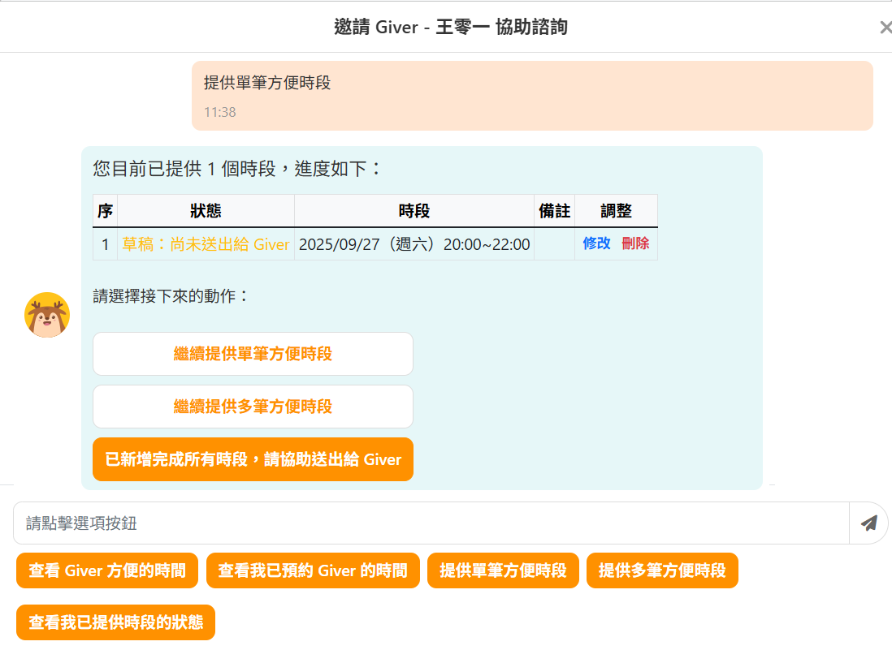

# 104 履歷診療室 - 平台內諮詢時間媒合系統

[](https://github.com/ewsailor/104-resume-clinic-scheduler)
[](https://www.python.org/downloads/)
[](https://fastapi.tiangolo.com/)
[](https://www.mysql.com/)
[](https://python-poetry.org/)
[](https://github.com/ewsailor/104-resume-clinic-scheduler/actions/workflows/ci.yml)
[](https://github.com/ewsailor/104-resume-clinic-scheduler)

## <a name="目錄"></a>目錄

- [專案概述](#專案概述)
  - [核心目標](#核心目標)
  - [使用者故事](#使用者故事)
  - [使用者流程圖](#使用者流程圖)
  - [使用者介面截圖](#使用者介面截圖)
- [設計原則](#設計原則)
  - [安全性](#安全性)
  - [可維護性與可擴充性](#可維護性與可擴充性)
  - [可靠性](#可靠性)
  - [效能](#效能)
  - [開發效率提升](#開發效率提升)
- [快速開始](#快速開始)
  - [環境需求](#環境需求)、
  - [安裝步驟](#安裝步驟)
  - [啟動方式](#啟動方式)
- [技術架構](#技術架構)
  - [專案結構](#專案結構)
  - [ERD 實體關聯圖](#ERD-實體關聯圖)
  - [API 文檔](#api-文檔)
    - Swagger、API 端點概覽、RESTful API 範例請求與回應、版本控制、狀態碼的使用
  - [測試](#測試)
    - 測試覆蓋率、夾具 Fixtures 集中化管理測試常數、單元測試、整合測試
  - [自動化測試](#cicd)
    - CI/CD 的 CI、pre-commit
- [未來規劃](未來規劃)
  - 專案的潛在發展與改進方向、JWT、Redis、MongoDB、Docker、AWS 部署
- **後續擴充**:
  - **Redis**：快取和即時資料 (提升效能)
  - **MongoDB**：彈性資料儲存 (高效能文件資料庫)
  - **Docker**：容器化部署 (資源優化)
  - **AWS**：雲端擴充性
- [開發者](開發者)
  - Email、LinkedIn、GitHub

提供 CI/CD 流水線的截圖或簡單說明。

## <a name="專案概述"></a>專案概述 [返回目錄 ↑](#目錄)

### <a name="核心目標"></a>核心目標 [返回目錄 ↑](#目錄)

讓 Giver（診療服務提供者）與 Taker（診療服務接受者）能在平台內，方便地設定可面談時段並完成配對媒合，同時提供即時通知，以減少等待回應時的不確定與焦慮感。

### <a name="使用者故事"></a>使用者故事 User Stories [返回目錄 ↑](#目錄)

完整使用者故事請[點此](./docs/user-stories.md)查看，以下簡述本專案的主要使用者故事：

- Giver 提供可預約的時段，讓 Taker 預約面談
- Taker 提供方便的時段，待 Giver 回覆是否方便面談
  - 因 Giver 尚未提供可預約的時段，Taker 無法預約面談
  - 因 Giver 已提供的方便時段，Taker 均不方便面談

#### **已完成功能**

- ✅ 時段的 CRUD 操作：使用者新增、查詢、編輯、刪除時段
- ✅ 時段重疊檢查，避免新增或更新時段時造成衝突
- ✅ 查詢支援多種篩選條件
- ✅ 軟刪除機制和審計追蹤
- ✅ 時段狀態 ENUM 管理：DRAFT、AVAILABLE、PENDING、ACCEPTED、REJECTED、CANCELLED、COMPLETED

#### **待開發功能**

- 登入功能
- 通知系統：即時訊息通知、預計回覆時間通知、自動提醒功能（逾期回覆提醒）
- 鎖定已被預約的時段，避免時段被重複預約
- 媒合與使用數據報表

### <a name="使用者流程圖"></a>使用者流程圖 [返回目錄 ↑](#目錄)

完整流程請詳下圖，以下簡述本專案的主要使用者流程：

- **Giver 流程**
  - Giver 提供可預約的時段，讓 Taker 預約面談
  - Giver 查看 Taker 提供的時段，並回覆自己是否方便
- **Taker 流程**
  - Taker 查看 Giver 提供的時段，並進行預約
  - Taker 提供方便的時段，待 Giver 回覆是否方便面談
- **回覆流程**
  - 收到方不行：流程重來
  - 收到方可以
    - 送出方不行：流程重來
    - 送出方可以：進行諮詢


### <a name="使用者介面截圖"></a>使用者介面截圖 [返回目錄 ↑](#目錄)

- Giver 列表
  - 
- Taker 預約 Giver 時段
  - 
  - 
- Taker 提供方便時段給 Giver
  - 
  - 

## <a name="設計原則"></a>設計原則 [返回目錄 ↑](#目錄)

主要使用技術為 Python、FastAPI 框架 + SQLAlchemy、MySQL/MariaDB 資料庫，採微服務分層模組避免高耦合，提供時段（Schedule）的 CRUD API 與 Swagger API 文件，用 Postman、pytest、pre-commit、CI/CD 的 CI 確保程式碼品質，並有考量安全性、可維護性與可擴充性、可靠性、效能、開發效率。

### <a name="安全性"></a>安全性 [返回目錄 ↑](#目錄)

- **.env 管理環境變數**：`.env` 檔案被 `.gitignore` 忽略，避免敏感資訊被提交到公開的 GitHub
- **Pydantic Settings 配置管理**：配置參數從 `.env` 讀取避免敏感資訊洩露，且讀取時會驗證每個值的型別，降低錯誤配置風險
- **CORS 跨域請求控管**：只允許經授權的網域訪問後端 API，避免惡意網站存取後端 API
- **ORM 避免 SQL 注入**：ORM 將傳入資料視為「參數」而不是「指令」，故傳入的惡意資料，即使被拼接也不會被當作 SQL 指令執行而避免 SQL 注入
- **最小權限原則**：避免使用 root 進行資料庫操作，而是建立使用者，並只授予其在資料庫上所有資料表必要的權限
- **Enum 列舉型別**：防止不合法的值，被賦給變數

### <a name="可維護性與可擴充性"></a>可維護性與可擴充性 [返回目錄 ↑](#目錄)

- **FastAPI 自動生成文件**：自動依據路由和 Pydantic 型別生成 OpenAPI 規範文檔，提供互動式測試的 Swagger UI、單頁式閱讀介面的 Redoc，減少維護 API 文件的工作量
- **FastAPI 依賴注入**：將資料庫連線、權限驗證、設定檔讀取等邏輯封裝在一個獨立函式（依賴）中，並在需要的地方透過 Depends() 注入，需升級某功能時只需修改注入的依賴
- **CI/CD 的 CI**：每次提交程式碼前，會自動執行 pre-commit hooks、pytest 測試，確保程式碼品質
- **Pre-commit**：每次提交 commit 前自動檢查以下項目，確保程式碼品質
  - **fix_imports.py**：自定義腳本，將函式內部的 import 語句移到檔案頂部
  - **autoflake**：移除所有未使用的 import、變數
  - **isort**：自動整理 import 語句的順序
  - **Black**：統一程式碼風格，如縮排、換行、空格、行長度等
  - **Flake8**：檢查程式碼是否符合 PEP8 規範，避免語法錯誤、潛在錯誤
  - **MyPy**：確保程式碼都有型別標註，並在程式執行前就檢查型別錯誤
- **錯誤處理 Decorator**：統一錯誤回傳格式，避免在每個函式中寫重覆的 try...except
- **自定義錯誤處理**：自定義不同層級可能遇到的錯誤類型，除錯時能快速定位是哪個層級拋出的錯誤
- **Log Decorator**：統一日誌記錄格式，除錯時能快速定位問題根源
- **微服務分層模組**：從用戶請求到回應，依職責拆分成 CORS → Routers → Schemas → Service → CRUD → Models → DB
- **SQLAlchemy ORM**：可用直觀的 Python 物件而非 SQL 操作資料庫，且資料庫切換時只需改連線設定，不需重寫資料庫操作程式碼
- **Alembic 資料庫遷移**：讓資料庫遷移像程式碼版本控制一樣，方便回溯與管理
- **Poetry 套件管理**：用 `pyproject.toml` 定義依賴的版本範圍，用 `poetry.lock` 鎖定確切依賴版本，確保環境一致性
- **Enum 列舉型別**：修改選項時只需改 Enum 定義，使用的地方會自動更新，降低維護成本
- **軟刪除**：避免誤刪資料，方便未來還原資料

### <a name="可靠性"></a>可靠性 [返回目錄 ↑](#目錄)

- **FastAPI 型別檢查**：自動檢查傳入資料的型別，確保符合 Pydantic 模型定義，避免非法資料導致系統錯誤或崩潰
- **測試覆蓋率 80％**：透過 pytest 進行單元測試、整合測試，測試覆蓋率 80%，確保各模組正常運作
- **Pydantic 輸入驗證**：輸入資料不符合 schema 設定的型別和格式會報錯，避免程式因不正確資料而導致的程式崩潰或非預期行為
- **健康檢查**：監控應用程式是否存活、就緒，異常發生時自動重啟或流量導向健康的實例，確保服務穩定
- **錯誤處理 Decorator**：攔截錯誤與例外，避免未捕捉錯誤導致服務中斷
- **Log Decorator**：藉日誌監控應用程式的運行狀態，以提早發現效能瓶頸或不正常行為，如被頻繁呼叫的 API、處理時間過長的請求
- **資料庫事務管理**：透過回滾 Rollback 裝飾器，落實 ACID 原則，防範資料不一致性問題
- **資料庫連線池**：連線池事先準備好一定數量的連線，確保高併發狀況下仍能穩定回應請求
- **外鍵約束避免孤兒紀錄**：確保子表的外鍵都有對應到父表中存在的主鍵，避免因父表刪除產生孤兒紀錄
- **SQLite 測試環境**：不需啟動完整資料庫伺服器即可運行，確保測試失敗代表程式碼問題，而不是環境問題

### <a name="效能"></a>效能 [返回目錄 ↑](#目錄)

- **FastAPI 非同步框架**：支援 ASGI 非同步伺服器 Uvicorn，利用 async/await 提升吞吐量，支援高併發 API 請求
- **Eager loading 解決 N+1**：JOIN 查詢時載入所需關聯資料，避免多次查詢的 N+1 問題，適用高頻率查詢場景如查詢時段列表、Giver 資訊、Taker 資訊
- **Lazy loading**：需要時才載入子表，避免不必要資料抓取，適用低頻率查詢場景如審計欄位
- **資料庫索引**：為高頻率查詢場景建立索引避免全表掃描、低頻率查詢場景不建立索引避免系統負擔、選擇性高欄位放複合索引前面提高效率、覆蓋索引盡可能涵蓋查詢所需欄位
- **Jinja2 模板引擎**：將模板先編譯成 Python 程式碼避免每次請求都解析原始模板、支援快取已編譯的模板
- **Bootstrap 響應式網格**：網站依不同裝置（手機、平板、桌面）自動調整版面，減少因不同裝置重新渲染導致頁面載入變慢
- **靜態資源預載入**：透過 HTML preload、prefetch，在瀏覽器解析 HTML 時即開始下載關鍵資源，避免資源使用時才開始下載造成阻塞，提高頁面渲染速度

### <a name="開發效率提升"></a>開發效率提升 [返回目錄 ↑](#目錄)

- **Cursor**：能根據上下文即時生成或補全程式碼、排除語法錯誤和潛在邏輯問題、快速重新命名變數提取函式、降低拼寫錯誤造成的 bug 等
- **熱重載**：Uvicorn 啟動時加上 --reload 參數，修改後自動重新啟動伺服器，立即看到修改效果
- **Jira**：有助開發團隊管理任務、掌握分工與優先順序、追蹤進度
  - 
- **MySQL Workbench**：提供視覺化介面，有助開發團隊掌握資料表結構、查看資料庫中儲存的資料的值
  - 
  - 
- **Sourcetree**：視覺化 Git，有助開發團隊更輕鬆地進行程式碼合併、分支管理、衝突解決
  - 
- **Postman**：提供視覺化介面，有助開發團隊測試驗證 API，並可保存測試腳本，一鍵測試所有 API
  - 

## <a name="快速開始"></a>快速開始 [返回目錄 ↑](#目錄)

### <a name="環境需求"></a>1. 環境需求 [返回目錄 ↑](#目錄)

- **Python**：3.9+
  - Python 3.9+ 支援語法：
    - 可用 `dict`、`list`、`set`、`tuple` 取代 `Dict`、`List`、`Set`、`Tuple`，不需額外匯入 `typing` 模組
  - Python 3.10+ 支援語法：
    - 可用 `match`/`case` 減少大量 `if-elif-else`
    - 可用 `X | Y` 替代 `Union[X, Y]` 聯合類型
    - 可用 `X | None` 替代 `Optional[X]` 可選類型
- **FastAPI**
- **Uvicorn**
- **Poetry**
- **資料庫**
  - MySQL 或 MariaDB：儲存使用者資料和預約資訊
  - SQLite：測試環境使用

### <a name="安裝步驟"></a>2. 安裝步驟 [返回目錄 ↑](#目錄)

1. **複製專案**

   ```bash
   git clone https://github.com/ewsailor/104-resume-clinic-scheduler.git
   cd 104-resume-clinic-scheduler
   ```

2. **安裝 Python 3.9+**

   - 下載並安裝 [Python 3.9+](https://www.python.org/downloads/)
   - 確認版本：
     ```bash
     python --version
     ```

3. **安裝 Poetry**

   ```bash
   pip install poetry
   ```

4. **用 Poetry 安裝 FastAPI、Uvicorn 等所有依賴套件**

   ```bash
   poetry install
   ```

5. **安裝資料庫**

   - 下載並安裝 [MySQL Installer](https://dev.mysql.com/downloads/installer/)
   - SQLite 通常內建在 Python 中，無需額外安裝

6. **設定環境變數**

   1. 複製 .env.example 檔案，命名為 .env，並填入密碼、資料庫設定等資訊

      ```bash
      cp .env.example .env
      ```

   2. 確保 `.env` 被 `.gitignore` 忽略：在專案根目錄建立 .gitignore，並在 .gitignore 中加入以下程式碼
      ```bash
      .env
      ```

7. **以 root 身份登入 MySQL**

   ```bash
   mysql -u root -p
   ```

   - 連接到 MySQL：使用者以 root 身份登入 MySQL，並輸入 root 密碼以登入 MySQL

8. **資料庫初始化**

   1. 刪除並重新建立資料庫，加上字符集和排序規則，然後切換到 scheduler_db 資料庫

      ```
      DROP DATABASE IF EXISTS `scheduler_db`;
      CREATE DATABASE `scheduler_db`
          DEFAULT CHARACTER SET utf8mb4
          COLLATE utf8mb4_unicode_ci;
      USE `scheduler_db`;
      ```

   2. 刪除並重新建立名為 fastapi_user 的使用者，避免使用 root 進行日常操作，提升安全性

      ```
      DROP USER IF EXISTS 'fastapi_user'@'localhost';
      CREATE USER 'fastapi_user'@'localhost'
          IDENTIFIED BY 'fastapi123';
      ```

   3. 撤銷任何意外預設權限，並遵循最小權限原則，重新給予 fastapi_user 在 scheduler_db 這個資料庫上所有資料表必要的權限，確保安全性（通常 DROP USER 後不需要，但加上更保險）

      ```
      REVOKE ALL PRIVILEGES ON `scheduler_db`.*
          FROM 'fastapi_user'@'localhost';
      GRANT SELECT, INSERT, UPDATE, DELETE, CREATE, INDEX, ALTER
          ON `scheduler_db`.*
          TO 'fastapi_user'@'localhost';
      ```

   4. 重新整理權限表，讓權限即時生效

      ```
      FLUSH PRIVILEGES;
      ```

   5. 檢查資料庫使用者權限：顯示 fastapi_user 的所有授權清單，確認是否設置成功
      ```
      SHOW GRANTS FOR 'fastapi_user'@'localhost';
      ```

9. **用 Alembic 升級資料庫到最新版本**

   ```bash
   poetry run alembic upgrade head
   ```

### <a name="啟動方式"></a>3. 啟動方式 [返回目錄 ↑](#目錄)

1. **用 Poetry 啟動伺服器，確保環境一致性**

   ```bash
   poetry run uvicorn app.main:app --reload --reload-dir app
   ```

2. **瀏覽器輸入網址**

   訪問 http://127.0.0.1:8000

## <a name="技術架構"></a>技術架構 [返回目錄 ↑](#目錄)

### <a name="專案結構"></a>專案結構 [返回目錄 ↑](#目錄)

```
104-resume-clinic-scheduler/
├── .github\workflows\ci.yml      # CI/CD 的 CI
├── alembic/                      # 資料庫遷移管理
├── app/                          # 應用程式主目錄
│   ├── core/                     # 設定管理
│   ├── crud/                     # CRUD 資料庫操作層
│   ├── database/                 # 資料庫連線管理
│   ├── decorators/               # 裝飾器
│   │   ├── logging.py            # 日誌裝飾器
│   │   └── error_handlers.py     # 錯誤處理裝飾器
│   ├── enums/                    # 列舉型別定義
│   ├── errors/                   # 錯誤處理系統
│   │   ├── error_codes           # 各層級錯誤代碼
│   │   ├── exceptions.py         # 自定義異常
│   │   ├── formatters.py         # 錯誤格式化
│   │   └── handlers.py           # 錯誤處理器
│   ├── middleware/               # 中間件 CORS
│   ├── models/                   # SQLAlchemy 資料模型
│   ├── routers/                  # API 路由模組
│   │   ├── api/                  # API 端點
│   │   │   └── schedule.py       # 時段管理 API
│   │   ├── health.py             # 健康檢查端點
│   │   └── main.py               # 主要路由
│   ├── schemas/                  # Pydantic 資料驗證
│   ├── services/                 # 業務邏輯層
│   ├── templates/                # HTML 模板
│   ├── utils/                    # 工具模組
│   ├── factory.py                # 應用程式工廠
│   └── main.py                   # 應用程式入口點
├── database/                     # 資料庫相關檔案
│   └── schema.sql                # 資料庫結構檔案
├── docs/                         # 文件目錄
│   ├── technical/                # 技術文件
│   │   └── api/                  # API 技術文件
│   │       ├── api-best-practices.md      # API 最佳實踐
│   │       ├── api-design.md             # API 設計
│   │       ├── api-endpoints-reference.md # API 端點參考
│   │       └── api-layered-architecture.md # API 分層架構
│   ├── testing/                  # 測試相關文件
│   │   ├── 104_resume_clinic_api_collection.json # Postman 測試集合
│   │   ├── postman_testing_guide.md       # Postman 測試指南
│   │   └── schedule_api_examples.md        # 排程 API 範例
│   ├── README.md                 # 文件說明
│   └── user-stories.md           # 使用者故事
├── htmlcov/                      # 測試覆蓋率報告
├── logs/                         # 日誌檔案
├── scripts/                      # 開發工具腳本
│   ├── clear_cache.py            # 清除快取腳本
│   └── fix_imports.py            # 修復匯入腳本
├── static/                       # 靜態檔案
│   ├── images/                   # 圖片資源
│   ├── css/                      # 樣式檔案
│   └── js/                       # JavaScript 檔案
├── tests/                        # 測試檔案
│   ├── unit/                     # 單元測試
│   ├── integration/              # 整合測試
│   ├── utils/                    # 測試工具
│   │   └── test_utils.py         # 測試工具函式
│   ├── conftest.py               # 測試配置
│   └── README.md                 # 測試說明
├── .env                          # 環境變數（本地開發）
├── .env.example                  # 環境變數範本
├── .flake8                       # Flake8 配置
├── .gitignore                    # Git 忽略檔案
├── .pre-commit-config.yaml       # Pre-commit 配置
├── coverage.xml                  # 測試覆蓋率報告
├── openapi.json                  # OpenAPI 規格檔案
├── poetry.lock                   # Poetry 依賴鎖定
├── pyproject.toml                # Poetry 專案配置
└── README.md                     # 專案說明文件
```

- **ERD 實體關聯圖**：

視覺化呈現資料庫中，有助開發團隊釐清各資料表的關聯，減少因資料庫設計問題而產生的反覆修改和重工

[ERD 實體關聯圖](static/images/database/erd.svg)

API 文檔

### **分層架構設計**

- **API 層** (`routers/`)：處理 HTTP 請求和回應
- **業務邏輯層** (`services/`)：處理業務規則和邏輯
- **資料存取層** (`crud/`)：資料庫 CRUD 操作
- **資料模型層** (`models/`)：SQLAlchemy 模型定義
- **驗證層** (`schemas/`)：Pydantic 資料驗證

## <a name="測試指南"></a>測試指南 [返回目錄 ↑](#目錄)

### 測試工具

- **Pytest**：測試框架
- **Pytest-asyncio**：異步測試支援
- **HTTPX**：FastAPI 測試客戶端
- **測試常數管理**：集中化管理測試常數，確保一致性
- **測試覆蓋率**：使用 pytest-cov 進行覆蓋率分析

### 測試策略

- **單元測試** (`tests/unit/`)：測試個別函數、類別和模組
  - 模型測試：資料庫模型和驗證
  - CRUD 測試：資料庫操作
  - 工具函數測試：輔助工具和配置
  - 中間件測試：CORS 等中間件功能
- **整合測試** (`tests/integration/`)：測試多個組件之間的互動
  - API 測試：端點功能和整合
  - 資料庫整合測試：資料庫操作和整合
- **端到端測試** (`tests/e2e/`)：測試完整的用戶工作流程
- **測試資料管理** (`tests/fixtures/`)：集中管理測試資料和 Fixtures

### 執行測試

```bash
# 執行所有測試
pytest

# 執行特定類型的測試
pytest tests/unit/           # 單元測試
pytest tests/integration/    # 整合測試
pytest tests/e2e/           # 端到端測試

# 執行特定模組的測試
pytest tests/unit/models/    # 模型測試
pytest tests/integration/api/ # API 測試

# 執行測試並生成覆蓋率報告
pytest --cov=app --cov-report=html

# 執行測試（推薦）
poetry run pytest

# 快速測試（開發期間）
./scripts/quick-test.sh

# 完整 CI/CD 流程（本地）
./scripts/run-ci-locally.sh
```

### CI/CD 自動化測試

專案使用 GitHub Actions 進行自動化 CI/CD 流程：

#### 工作流程

1. **代碼品質檢查**：

   - Black 代碼格式化檢查
   - isort 導入排序檢查
   - flake8 代碼風格檢查
   - mypy 類型檢查

2. **測試執行**：

   - 支援 Python 3.9, 3.10, 3.11 多版本測試
   - 單元測試、整合測試、端到端測試
   - 測試覆蓋率報告

3. **安全檢查**：

   - safety 依賴漏洞檢查
   - bandit 安全代碼分析

4. **自動部署**：
   - develop 分支 → 測試環境
   - main 分支 → 生產環境

#### 狀態徽章

### 測試說明

專案使用 pytest 作為測試框架，提供完整的測試覆蓋率分析。

### 測試常數管理

專案使用 `tests/constants.py` 集中管理所有測試常數：

- **避免硬編碼**：所有測試值都使用常數
- **一致性保證**：確保所有測試使用相同的值
- **易於維護**：修改常數值時只需更新一個地方
- **可重用性**：常數可以在多個測試檔案中共享

詳細使用方式請參考：[測試管理指南](tests/README.md)

### 程式碼品質檢查

```bash
# 格式化程式碼
poetry run black app/

# 整理 import 語句
poetry run isort app/

# 型別檢查
poetry run mypy app/

# 程式碼風格檢查
poetry run flake8 app/
```

已整合 **pre-commit hooks**：

- `autoflake` → 移除未使用 import / 變數
- `isort` → 排序 import
- `black` → 自動格式化程式碼
- `flake8` → 靜態程式檢查
- `mypy` → 型別檢查

安裝 pre-commit：

```bash
pre-commit install

```

## <a name="cicd"></a>CI/CD [返回目錄 ↑](#目錄)

專案包含 GitHub Actions (`.github/workflows/ci.yml`)，在每次 `git push origin main` 時自動執行：

- Lint / 型別檢查
- 單元測試（pytest）

成功後會顯示綠色的 CI Badge，代表程式碼與測試通過。

## <a name="api-文檔"></a>API 文檔 [返回目錄 ↑](#目錄)

### **API 端點概覽**

#### 健康檢查端點

- **基本健康檢查**：`GET /healthz` - 檢查應用程式是否正在運行
- **就緒檢查**：`GET /readyz` - 檢查應用程式和資料庫是否準備好接收流量

#### 使用者管理 API

- **取得使用者列表**：`GET /api/v1/users/` - 取得所有使用者
- **取得特定使用者**：`GET /api/v1/users/{user_id}` - 取得特定使用者資訊
- **建立使用者**：`POST /api/v1/users/` - 建立新使用者
- **更新使用者**：`PUT /api/v1/users/{user_id}` - 更新使用者資訊

#### 排程管理 API

- **取得排程列表**：`GET /api/v1/schedules/` - 取得所有排程
- **取得特定排程**：`GET /api/v1/schedules/{schedule_id}` - 取得特定排程資訊
- **建立排程**：`POST /api/v1/schedules/` - 建立新排程
- **更新排程**：`PATCH /api/v1/schedules/{schedule_id}` - 更新排程資訊
- **刪除排程**：`DELETE /api/v1/schedules/{schedule_id}` - 刪除排程

### **API 文件**

啟動伺服器後，可以訪問以下文件：

- **Swagger UI**：http://127.0.0.1:8000/docs
- **ReDoc**：http://127.0.0.1:8000/redoc

### **API 使用範例**

```bash
# 健康檢查
curl http://127.0.0.1:8000/healthz

# 建立新排程
curl -X POST http://127.0.0.1:8000/api/v1/schedules/ \
  -H "Content-Type: application/json" \
  -d '{"giver_id": 1, "taker_id": 2, "start_time": "2025-01-15T10:00:00Z"}'
```

### 建立時段

```bash
curl -X POST "http://localhost:8000/schedules" \
     -H "Content-Type: application/json" \
     -d '{"giver_id": 1, "taker_id": 2, "date": "2025-09-01", "status": "PENDING"}'

```

### 查詢時段

```bash
curl -X GET "http://localhost:8000/schedules?giver_id=1"

```

## <a name="故障排除"></a>故障排除 [返回目錄 ↑](#目錄)

### **常見問題**

#### 1. 資料庫連線問題

```bash
# 錯誤：OperationalError: (2003, "Can't connect to MySQL server")
# 解決方案：
# 1. 確認 MySQL 服務正在運行
sudo systemctl start mysql

# 2. 檢查資料庫連線設定
cat .env | grep DATABASE

# 3. 測試資料庫連線
poetry run python scripts/test_database_connection.py
```

#### 2. 環境變數問題

```bash
# 錯誤：KeyError: 'DATABASE_URL'
# 解決方案：
# 1. 確認 .env 檔案存在
ls -la .env

# 2. 檢查環境變數設定
poetry run python scripts/config_validator.py
```

#### 3. 測試警告問題

```bash
# 警告：PendingDeprecationWarning: multipart
# 解決方案：使用標準 pytest 命令
poetry run pytest
```

#### 4. 資料庫遷移問題

```bash
# 錯誤：Alembic revision failed
# 解決方案：
# 1. 檢查模型變更
poetry run alembic check

# 2. 手動建立遷移
poetry run alembic revision --autogenerate -m "描述變更"

# 3. 應用遷移
poetry run alembic upgrade head
```

### **尋求協助**

如果遇到其他問題，請：

1. 查看 [Issues](https://github.com/ewsailor/104-resume-clinic-scheduler/issues) 是否有類似問題
2. 檢查 [文檔目錄](docs/) 中的相關指南
3. 建立新的 Issue，並提供詳細的錯誤資訊

## <a name="開發指南"></a>開發指南 [返回目錄 ↑](#目錄)

### **開發環境設定**

1. **安裝開發工具**

   ```bash
   # 安裝 pre-commit hooks
   poetry run pre-commit install

   # 設定 Git hooks
   poetry run pre-commit install --hook-type commit-msg
   ```

2. **程式碼品質檢查**

   ```bash
   # 格式化程式碼
   poetry run black app/

   # 整理 import 語句
   poetry run isort app/

   # 型別檢查
   poetry run mypy app/

   # 程式碼風格檢查
   poetry run flake8 app/
   ```

3. **測試執行**

   ```bash
   # 執行所有測試
   poetry run pytest

   # 執行測試並生成覆蓋率報告
   poetry run pytest --cov=app --cov-report=html
   ```

## <a name="貢獻指南"></a>貢獻指南 [返回目錄 ↑](#目錄)

### **貢獻流程**

1. **Fork 專案**

   ```bash
   # 在 GitHub 上 Fork 本專案
   # 然後複製到本地
   git clone https://github.com/YOUR_USERNAME/104-resume-clinic-scheduler.git
   cd 104-resume-clinic-scheduler
   ```

2. **建立功能分支**

   ```bash
   git checkout -b feature/your-feature-name
   ```

3. **開發和測試**

   ```bash
   # 安裝依賴
   poetry install

   # 執行測試
   poetry run pytest

   # 程式碼品質檢查
   poetry run black app/
   poetry run isort app/
   ```

4. **提交變更**

   ```bash
   git add .
   git commit -m "feat: 新增功能描述"
   git push origin feature/your-feature-name
   ```

5. **開啟 Pull Request**
   - 在 GitHub 上建立 Pull Request
   - 填寫詳細的變更說明
   - 確保所有測試通過

### **開發規範**

#### 程式碼風格

- 遵循 [PEP 8](https://www.python.org/dev/peps/pep-0008/) 程式碼風格
- 使用 [Black](https://black.readthedocs.io/) 進行程式碼格式化
- 使用 [isort](https://pycqa.github.io/isort/) 整理 import 語句

#### 測試要求

- 新增功能必須包含對應的測試案例
- 測試覆蓋率不得低於 80%
- 使用 `tests/constants.py` 中的測試常數

#### Commit 訊息規範

使用 [Conventional Commits](https://www.conventionalcommits.org/) 格式：

```bash
feat: 新增使用者管理功能
fix: 修復資料庫連線問題
docs: 更新 API 文檔
test: 新增使用者測試案例
refactor: 重構資料庫模型
```

#### 文件要求

- 遵循 PEP 8 程式碼風格
- 撰寫測試案例
- 新增功能必須更新相關文檔
- 複雜功能需要提供使用範例
- 更新 README.md 中的相關章節

## <a name="授權"></a>授權 [返回目錄 ↑](#目錄)

本專案採用 MIT 授權條款

## <a name="開發者"></a>開發者 [返回目錄 ↑](#目錄)

**Oscar Chung** - [GitHub](https://github.com/ewsailor)

## <a name="更新日誌"></a>更新日誌 [返回目錄 ↑](#目錄)

### v0.1.0 (2025-01-15)

- **Service 層架構完善**
  - 新增 `app/services/` 業務邏輯層，實現完整的分層架構
  - 建立 `ScheduleService` 和 `UserService` 類別，處理業務邏輯
  - 統一 Service 層的錯誤處理、日誌記錄和裝飾器使用
  - 實現 API → Service → CRUD → Model 的完整分層架構
- **架構對應關係統一**
  - 確保 SQL、Model、Schema、Route、Service、CRUD 六層完整對應
  - 修正 User 模組缺少 Service 層的問題
  - 統一所有模組的命名規範和程式碼結構
  - 實現職責分離：Route 處理 API、Service 處理業務邏輯、CRUD 處理資料庫
- **業務邏輯分離**
  - 將業務邏輯從 CRUD 層移至 Service 層
  - 實現時段重疊檢查、狀態決定、時間驗證等業務邏輯
  - 統一審計追蹤檢查和錯誤處理機制
  - 提供可重用和可測試的業務邏輯方法
- **文檔架構更新**
  - 更新 README.md 專案結構，加入 Service 層說明
  - 完善分層架構設計理念文檔
  - 更新技術架構說明，強調業務邏輯分離
- **測試架構優化**
  - 移除不存在的 validation 模組相關測試
  - 更新測試覆蓋率至 83%
  - 修正測試錯誤和模組導入問題
- **現代化更新**
  - 更新 FastAPI 版本至 0.116+
  - 優化 Pydantic v2 配置
  - 完善錯誤處理和日誌系統

### v1.3.0 (2025-01-15)

- **命名規範統一**
  - 統一 API 模型、CRUD 層、資料庫模型和前端之間的命名規範
  - 建立操作語義清晰的審計欄位命名（created_by, updated_by, deleted_by）
  - 優化 Pydantic v2 模型配置，支援 ORM 轉換和欄位名稱對應
  - 完善軟刪除機制，支援系統自動操作和審計追蹤
  - 確保所有測試通過，達到 221 passed, 2 skipped 的測試覆蓋率
- **API 模型優化**
  - 統一 `ScheduleCreateRequest`、`ScheduleDeleteRequest` 的欄位命名
  - 優化 `ScheduleData` 和 `ScheduleUpdateData` 的語義區分
  - 完善 API 請求/回應模型的型別安全
- **資料庫審計追蹤**
  - 實現完整的軟刪除機制（deleted_at, deleted_by, deleted_by_role）
  - 支援系統自動操作（NULL 值表示系統操作）
  - 建立完整的審計欄位追蹤（created_by, updated_by, deleted_by）
- **測試架構完善**
  - 修正所有測試中的參數名稱不一致問題
  - 統一 CRUD 測試、API 測試和整合測試的命名規範
  - 確保測試覆蓋率達到 90% 以上
- **技術文檔更新**
  - 新增 Pydantic v2 配置說明
  - 完善審計欄位設計理念文檔
  - 更新 API 模型命名規範指南

### v1.2.0 (2025-01-15)

- **專案架構重構**
  - 重新組織測試目錄結構（單元/整合/端到端測試）
  - 優化靜態檔案管理（圖片/CSS/JS 分類）
  - 建立完整的測試管理指南
  - 新增靜態檔案管理指南
- **測試架構改進**
  - 實現分層測試策略（unit/integration/e2e）
  - 建立測試命名規範和最佳實踐
  - 優化測試資料管理和 Fixtures
  - 新增測試覆蓋率目標設定
- **前端資源管理**
  - 重新組織靜態檔案目錄結構
  - 建立圖片資源分類（icons/ui/content）
  - 優化 CSS 和 JavaScript 檔案組織
  - 建立靜態檔案命名規範
- **文檔完善**
  - 更新專案結構文檔
  - 新增測試管理指南
  - 新增靜態檔案管理指南
  - 完善開發工具說明
- **團隊協作改進**
  - 建立團隊協作確認指標文檔
  - 提供跨角色協作檢查清單
  - 涵蓋 PM、前端工程師、QA、UI/UX 四個角色
  - 建立標準化的協作流程和品質標準
- **命名規範統一**
  - 統一 API 模型、CRUD 層、資料庫模型和前端之間的命名規範
  - 建立操作語義清晰的審計欄位命名（created_by, updated_by, deleted_by）
  - 優化 Pydantic v2 模型配置，支援 ORM 轉換和欄位名稱對應
  - 完善軟刪除機制，支援系統自動操作和審計追蹤
  - 確保所有測試通過，達到 221 passed, 2 skipped 的測試覆蓋率

### v1.1.0 (2025-01-10)

- **新增 Alembic 資料庫遷移工具**
  - 完整的資料庫版本控制
  - 自動檢測模型變更
  - 支援向前和向後遷移
  - 團隊協作資料庫同步
- **新增詳細文檔**
  - Alembic 使用指南
  - 遷移最佳實踐
  - 故障排除指南
- **開發工具改進**
  - 新增 Alembic 版本清理工具
  - 更新專案結構文檔

### v0.0.0 (2024-12-20)

- **初始版本發布**
  - 實現時間媒合系統核心功能
  - 建立 FastAPI 後端架構
  - 整合 MySQL 資料庫
  - 添加開發者工具和伺服器監控
  - 完善文件和使用說明
